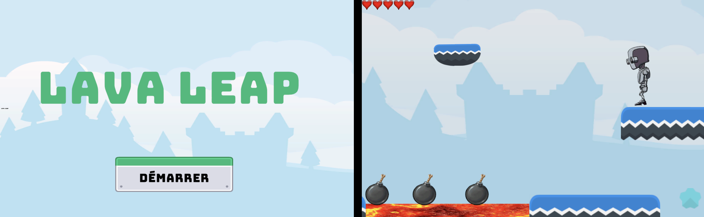

# Lava Leap - 2D Platformer Game



## Description
This project was developed as part of an **Introduction to Video Game Programming** course. The game is a platformer created using `Unity`, integrating class concepts such as character animations, keyboard controls, platform design with `2DSpriteShape`, interactive objects animated using the `Timeline`, and custom game logic implemented in `C#` scripts. These scripts manage character behavior, camera dynamics, accessory interactions, and core gameplay mechanics.

## Key Features

### Environment
- Platforms designed using `2DSpriteShape` for dynamic and visually appealing level design.
- Interactive objects (`accessories`) with unique animations and behaviors.

### Camera
- A dynamic camera that follows the character while staying within the game boundaries.

### Character: RobotBoy
- **Controls**:
  - **Movement**:
    - Use the arrow keys (`←`, `→`) to move left and right.
    - Press `W` to jump.
  - **Roll**:
    - Press the `X` key to perform a roll animation.
  - **Crouch**:
    - Press `S` to crouch, reducing the character's movement speed by half.
    - Release `S` to return to normal movement speed.
  - **Double Jump**:
    - Jump a second time while airborne (limited to two consecutive jumps).

- **Behavior**:
  - Background music plays when the character is present in the scene.

### Interactive Accessories
- **Bonus Accessories**:
  - Increase the number of lives by 1, with a configurable maximum.
- **Malus Accessories**:
  - Decrease the number of lives by 1. The character dies if lives reach zero.
- **Mortem Accessories**:
  - Trigger a death animation and replace the background music with a death theme. The game restarts after a set duration.

### Animations for Accessories
- Accessories are animated using the `Timeline` and include:
  - Two single-Timeline animations.
  - One animation combining two Timelines.
  - Animations using interpolation, frame-by-frame, particles, and sound effects.

### Interface
- **Start Screen**:
  - Features a graphical start screen with background music. The game starts upon clicking a button.
- **Lives Display**:
  - Displays the character's remaining lives using visual icons that reflect the character's current state.

### Scripts in C#
- The project includes custom C# scripts that manage:
  - **Camera Controls**:
    - A script ensures the camera dynamically tracks the character and stays within the game boundaries.
  - **Character Behavior**:
    - Handles character movement, animations (rolling, crouching, and jumping), and interactions with accessories.
  - **Accessory Interactions**:
    - Manages collision detection and specific behaviors for bonus, malus, and mortem accessories.
  - **Game Logic**:
    - Implements game mechanics such as life tracking, game restart logic, and background music management.

## Requirements
- **Unity Version**: `LTS 2022.3.40f1`
- Free or personally created assets (no copyrighted media).

## How to Play

1. Clone the repository:
    ```bash
    git clone https://github.com/yonahcodes/LavaLeap.git
    ```

2. Install Prerequisites:
    - Download and install `Unity Hub` from the official Unity website
    - Install Unity version `LTS 2022.3.40f1` through Unity Hub
    - Ensure you have a graphics card driver that supports Unity's requirements

3. Opening the Project:
    - Launch Unity Hub
    - Click `Add` and browse to the cloned repository folder
    - Select the project folder and open it in Unity Editor
